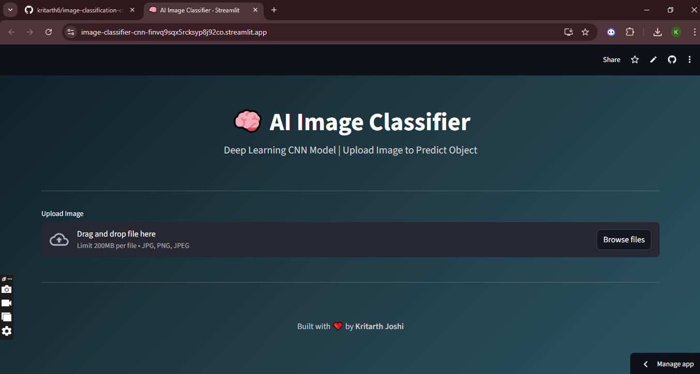
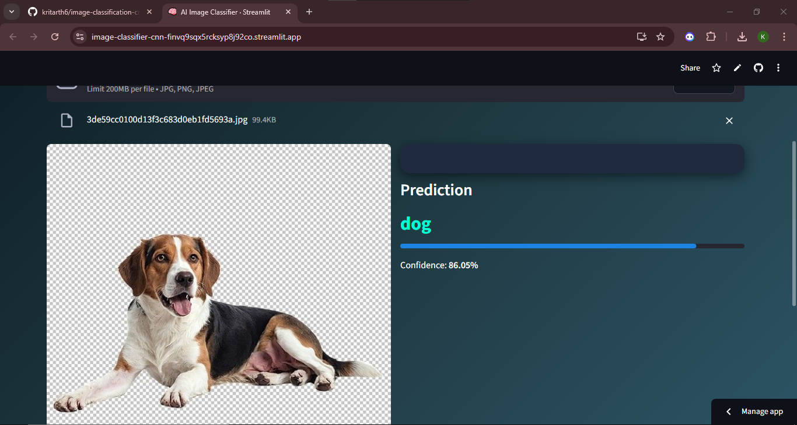

# 🧠 AI Image Classification using CNN

This project demonstrates a **Deep Learning Image Classification system** built using a **Convolutional Neural Network (CNN)** trained on the **CIFAR-10 dataset**.

The model is deployed using **Streamlit**, allowing users to upload an image and receive a predicted object class in real time.

---

# 🚀 Live Demo

Streamlit App
[Image Classification using CNN](https://image-classifier-cnn-finvq9sqx5rcksyp8j92co.streamlit.app/)

---

# 📸 Application Screenshots

## Before Uploading Image

This is the interface of the application before the user uploads an image.



---

## After Uploading Image

After uploading an image, the CNN model predicts the object class and displays the confidence score.



---

# 📌 Project Overview

Image classification is a core problem in computer vision. In this project, a **Convolutional Neural Network (CNN)** is trained to classify images into ten different object categories.

Users can interact with the model through a **Streamlit web interface** by uploading an image and receiving an instant prediction.

---

# 🧠 Deep Learning Pipeline

1. Load CIFAR-10 dataset
2. Image preprocessing and normalization
3. CNN architecture creation
4. Model training and validation
5. Model evaluation
6. Model deployment using Streamlit

---

# 📊 Dataset

Dataset used: **CIFAR-10**

Total Images: **60,000**

Image Size: **32 × 32 pixels**

Classes:

* Airplane
* Automobile
* Bird
* Cat
* Deer
* Dog
* Frog
* Horse
* Ship
* Truck

---

# ⚙️ Tech Stack

Programming Language
Python

Deep Learning Framework
TensorFlow / Keras

Deployment
Streamlit

Libraries
NumPy, Pillow

Visualization
Matplotlib

---

# 📂 Project Structure

```
image-classification-cnn
│
├── cnn_image_classifier.ipynb
├── cnn_model.h5
├── app.py
├── requirements.txt
└── README.md
```

---

# ▶️ Run Locally

Install dependencies

```
pip install -r requirements.txt
```

Run the Streamlit application

```
streamlit run app.py
```

---

# 💡 Future Improvements

* Implement **transfer learning (ResNet / MobileNet)**
* Add **Top-3 prediction probabilities**
* Support **drag-and-drop image uploads**
* Deploy using **Docker or cloud platforms**

---

# 👨‍💻 Author

Kritarth Joshi

GitHub
https://github.com/kritarth6
